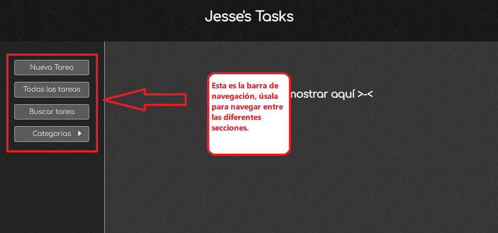
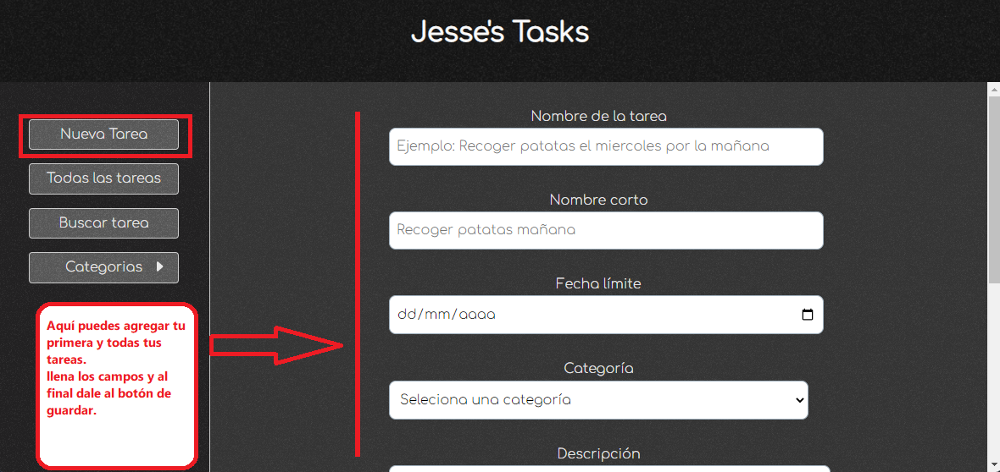
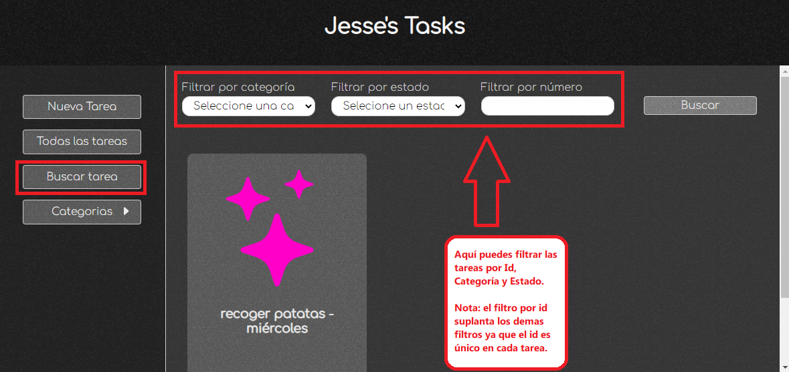
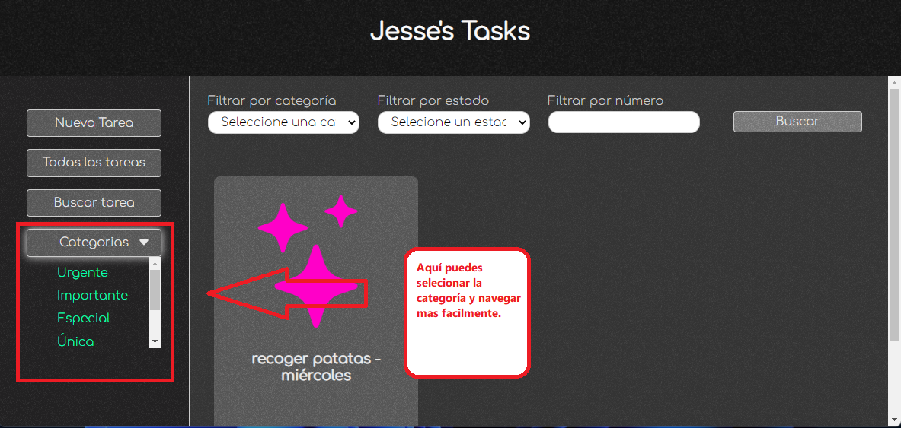
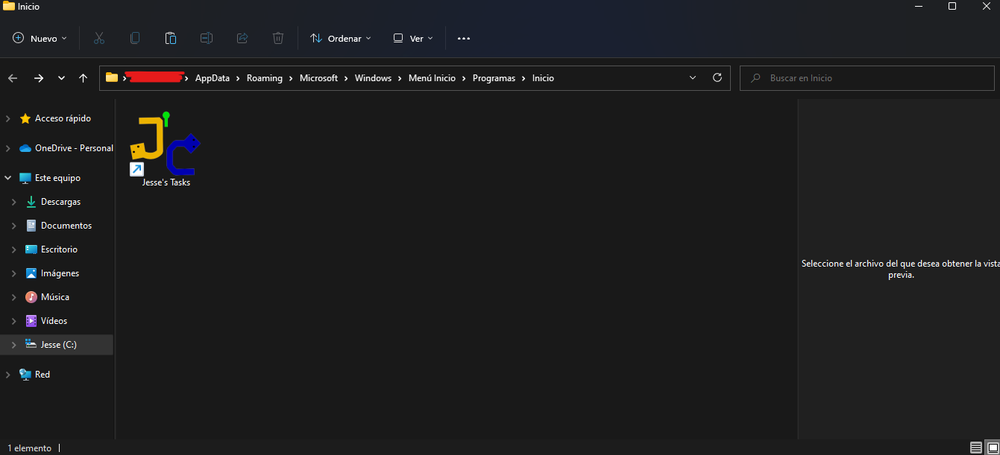

# Jesse's Tasks v0.0.1
Esta es la primera primera versión de Jesse's Tasks

# Uso de la aplicación
# Primero. ¿Qué es Jesse's Tasks?
Jesse's Tasks es una aplicación pensada para aquellos que tienen inúmeras tareas  para realizar pero son muy olvidadizos.  
Sí que es cierto que nuestra memoria puede recordar mas de 100 cosas al día, sin embargo, por algún motivo u otro, terminamos olvidando lo que tenemos que hacer.  
Muchas veces pensamos en comprar una agenda para hacer anotaciones de cada cosa, pero ¿Realmente tomamos el tiempo para leerla?  
En muchos casos acabamos perdiendo la agenda o quizás se moje, rompa o le pase alguna otra cosa, no es tan prático por ser de papel y muy vulnerable a que otras personas vean lo que hacemos.
¡Es por eso que <b>Jesse's Tasks</b> llegó!  
Ya que uno de los aparatos electrónicos que usamos muy amenudo es nuestra PC ¿Por qué no decirle que nos recuerde lo que debemos hacer?  
Jesse's Tasks busca ayudar a esas personas recordandoles cada tarea a realizar.

# Requisitos mínimos:

Jesse's tasks es una aplicación ligera y potente, por lo cual será facil tenerla aun en computadores de baja gama, sin embargo claro está que tiene unos requisitos mínimos:
<ul>
<li>RAM: 1GB</li>
<li>Procesador: Intel Celeron 900 MHz o equivalente</li>
<li>Sistema Operativo: Windows 7,8,8.1,10,11 (para arquitecturas x32 descargar la versión correspondiente)</li>
<li>Espacio en disco: 512MB (tal vez menos)</li>
</ul>

# Instalación:
Para instalar la aplicación descargue el archivo correspondiente y ejecute el instalador, en caso de haber descargado el archivo .zip descomprima y en la carpta busque el archivo <b>Jesse's Tasks v0.0.1.exe</b> y ejecute.

<b>!!IMPORTANTE: esta versión solo funciona en windows 10/11 x64bits</b>

# Componentes
Ahora veamos los componentes de la aplicación.

# Barra de navegación

# Nueva tarea

# Buscar Tareas

# Categorias

# Aun no terminamos
# Agregar la aplicación para que se inicie al arrancar el sistema.
Para eso presionamos las teclas <b> + R</b> y digitamos: <b>shell:startup</b> damos <b>Enter</b> y ya solo resta colocar los accesos directos dentro de la carpteta abierta.

# FIN.
Eso es todo en la version 0.0.1 por ahora, esperen a llegar mas versiones!!